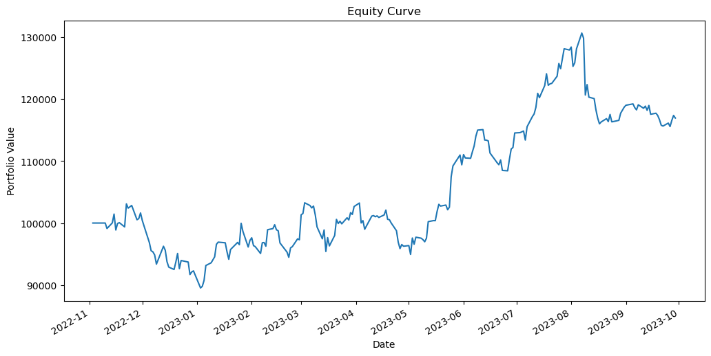
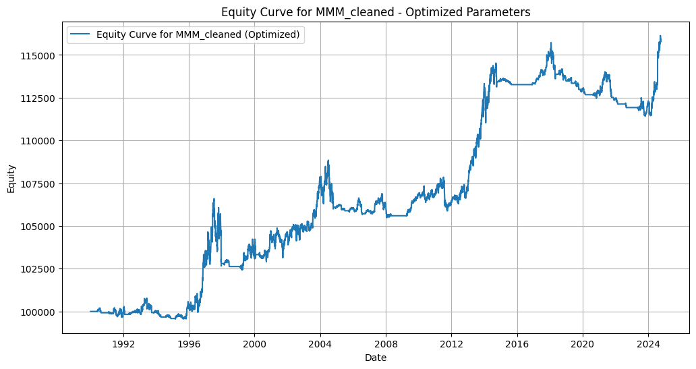
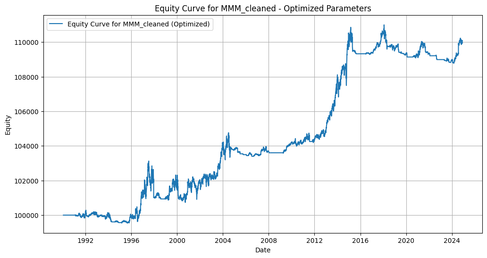

# Quantitative Trading Research System — Long Trend High Momentum Strategy

A systematic backtesting framework for evaluating momentum-based equity trading strategies across S&P 500 and NASDAQ universes. The core strategy, Long Trend High Momentum (LTHM), combines moving average trend filters with momentum ranking, ATR-based stop-loss management, and trailing stop exits. Built entirely in Python using backtesting.py and yfinance.

---

## Overview

This project implements and iteratively refines a quantitative trading strategy that targets stocks in established uptrends with strong relative momentum. The research spans multiple notebook iterations (V1 through V3.3), each introducing improvements to signal generation, position sizing, and exit mechanics.

The framework is designed for systematic strategy evaluation — not for live trading signals. It provides a reproducible environment for hypothesis testing, parameter optimization, and performance attribution across a broad equity universe.

---

## Strategy Description — Long Trend High Momentum (LTHM)

The LTHM strategy operates on daily price data and follows a three-stage process:

**Entry Signal:**
- The 25-day Simple Moving Average must be above the 50-day Simple Moving Average (trend confirmation)
- The stock must rank in the top percentile by 20-day momentum relative to its universe
- Minimum average daily dollar volume filter applied to ensure liquidity

**Exit Rules:**
- ATR-based trailing stop: position is exited when price falls more than a configurable ATR multiple below the recent peak
- Absolute stop-loss based on ATR at entry to cap downside per trade
- Moving average crossover reversal (25 SMA crosses below 50 SMA) triggers immediate exit

**Position Management:**
- Fixed capital allocation per position
- No leverage used
- Positions are re-evaluated at each daily bar

---

## Backtesting Results

Results across 15 S&P 500 constituents using 30+ years of daily data where available. All backtests start with $100,000 initial capital.

| Ticker | Total Return (%) | Buy & Hold (%) | Sharpe Ratio | Max Drawdown (%) | Win Rate (%) | Trades |
|--------|-----------------|---------------|--------------|-----------------|-------------|--------|
| MMM    | 15.77           | 703.89        | 0.299        | -5.17           | 47.14       | 70     |
| ABT    | 23.27           | 2,798.76      | 0.241        | -6.32           | 47.14       | 70     |
| ABBV   | 3.76            | 453.22        | 0.296        | -2.89           | 52.00       | 25     |
| ACN    | 4.29            | 2,287.87      | 0.159        | -3.79           | 34.69       | 49     |
| ADBE   | 27.24           | 39,976.64     | 0.232        | -7.54           | 38.30       | 47     |
| AES    | 6.99            | 477.11        | 0.139        | -5.47           | 26.67       | 60     |
| AFL    | 5.27            | 9,709.36      | 0.147        | -3.25           | 42.59       | 54     |
| A      | 7.70            | 360.61        | 0.218        | -3.03           | 35.56       | 45     |
| APD    | 4.15            | 2,393.94      | 0.099        | -5.69           | 35.21       | 71     |
| ABNB   | -1.19           | -10.27        | 0.000        | -2.64           | 14.29       | 7      |
| AKAM   | 3.73            | -30.10        | 0.113        | -3.88           | 25.58       | 43     |
| ALB    | 3.78            | 1,308.14      | 0.073        | -9.25           | 32.79       | 61     |
| ARE    | 18.96           | 447.14        | 0.302        | -6.38           | 42.62       | 61     |
| ALLE   | 3.33            | 200.35        | 0.324        | -2.56           | 47.83       | 23     |
| ALL    | 20.35           | 1,197.50      | 0.281        | -8.09           | 44.62       | 65     |

**Key observation:** The strategy consistently limits maximum drawdown to under -10% across all tested securities, compared to passive buy-and-hold strategies which experienced drawdowns of 40–80% during bear markets (2000–2002, 2008–2009, 2020). This makes LTHM suitable as a risk-managed component within a broader portfolio allocation framework.

---

## Strategy Charts

### LTHM Strategy on S&P 500 Universe



### Strategy V3 — Refined Entry and Exit Parameters



### Strategy V3.3 — Final Parameter Set



---

## Research Progression

The strategy was developed across five iterative notebook versions, each building on the findings of the previous:

| Notebook | Description |
|---|---|
| `01_lthm_sp500_strategy.ipynb` | Initial implementation of the LTHM strategy on S&P 500 tickers. Establishes the moving average crossover framework and momentum ranking baseline. |
| `02_strategy_v1.ipynb` | First complete backtest run. Evaluates raw performance across the full ticker universe. 22 output charts including equity curves and scatter plots of return vs. drawdown. |
| `03_strategy_v2.ipynb` | Introduces ATR-based trailing stop and refines momentum ranking window. 15 output charts. |
| `04_strategy_v3.ipynb` | Adds dollar volume liquidity filter and optimizes SMA window parameters. 12 output charts. |
| `05_strategy_v3_3.ipynb` | Final parameter set with tuned ATR multiplier and tightened stop-loss. Best balance of return and drawdown across the tested universe. |

---

## Technology Stack

| Component | Technology |
|---|---|
| Language | Python 3.10+ |
| Backtesting Engine | backtesting.py |
| Market Data | yfinance (Yahoo Finance API) |
| Data Processing | pandas, numpy |
| Visualization | matplotlib (embedded in notebooks) |
| Notebook Environment | Jupyter Notebook |

---

## Project Structure

```
quantitative-trading-system/
├── notebooks/
│   ├── 01_lthm_sp500_strategy.ipynb   # Initial LTHM strategy implementation
│   ├── 02_strategy_v1.ipynb           # V1 full backtest — 22 output charts
│   ├── 03_strategy_v2.ipynb           # V2 with ATR trailing stop — 15 charts
│   ├── 04_strategy_v3.ipynb           # V3 with liquidity filter — 12 charts
│   └── 05_strategy_v3_3.ipynb         # V3.3 final parameters — 4 charts
├── data/
│   ├── tickers/
│   │   ├── sp500_tickers.csv          # S&P 500 ticker universe
│   │   └── nasdaq_tickers.csv         # NASDAQ ticker universe
│   ├── backtest_results/
│   │   ├── sp500_backtest_results.csv  # Full results table — 15 stocks
│   │   └── nasdaq_backtest_results.csv # NASDAQ backtest results
│   └── cleaned/                        # Preprocessed OHLCV + benchmark data
│       └── [ticker]_cleaned.csv        # Date, OHLCV, Adj Close, SP500_Close
├── trade_logs/                         # Per-trade logs with entry/exit/PnL
│   └── [ticker]_trades.csv
├── screenshots/                        # Exported equity curve charts
└── README.md
```

---

## Getting Started

**Step 1: Clone the repository**
```bash
git clone https://github.com/AbdulRehmanRattu/quantitative-trading-system.git
cd quantitative-trading-system
```

**Step 2: Install dependencies**
```bash
pip install backtesting yfinance pandas numpy matplotlib jupyter
```

**Step 3: Launch notebooks**
```bash
jupyter notebook
```

Open any notebook in the `notebooks/` folder. All notebooks are fully executed and include embedded chart outputs — no need to re-run to view results.

**Step 4: Run a fresh backtest (optional)**

Each notebook downloads data fresh from Yahoo Finance via yfinance. Simply run all cells in sequence. Ensure internet access is available for the data download step.

---

## Data

**Ticker Universe**

The S&P 500 and NASDAQ universes are defined in `data/tickers/`. Tickers were selected to represent a diverse cross-section of sectors and market capitalizations.

**Cleaned Data**

The `data/cleaned/` directory contains preprocessed OHLCV data merged with the S&P 500 benchmark close price. Each file covers the full available history from Yahoo Finance through October 2024.

**Backtest Results**

The `data/backtest_results/` directory contains the full output of the backtesting engine for each tested security, including equity final, return, buy-and-hold return, Sharpe ratio, Sortino ratio, Calmar ratio, max drawdown, win rate, profit factor, and SQN.

**Trade Logs**

The `trade_logs/` directory contains per-trade records for each backtested security: entry bar, exit bar, entry price, exit price, PnL, return percentage, and trade duration.

---

## Strategy Parameters

These are the final parameter values used in `05_strategy_v3_3.ipynb`:

| Parameter | Value | Description |
|---|---|---|
| Fast SMA | 25 days | Short-term trend confirmation |
| Slow SMA | 50 days | Long-term trend confirmation |
| Momentum Window | 20 days | Lookback for momentum ranking |
| ATR Period | 14 days | ATR calculation window |
| ATR Trailing Multiplier | 3.0x | Trailing stop distance in ATR units |
| Min Dollar Volume | $50M/day | Liquidity filter threshold |
| Initial Capital | $100,000 | Starting equity for all backtests |

---

## Author

**Abdul Rehman Rattu**
Founder and CEO, Rapide Technologies

- Email: rattu786.ar@gmail.com
- LinkedIn: [linkedin.com/in/abdul-rehman-rattu-395bba237](https://www.linkedin.com/in/abdul-rehman-rattu-395bba237)

---

## License

This project is released under the MIT License. You are free to use, modify, and distribute it with attribution.

---

## Disclaimer

This project is for research and educational purposes only. The backtested results presented do not represent actual trading performance and are not a guarantee of future results. Past performance of a simulated strategy is not indicative of future returns. Do not make investment decisions based solely on backtested data.
